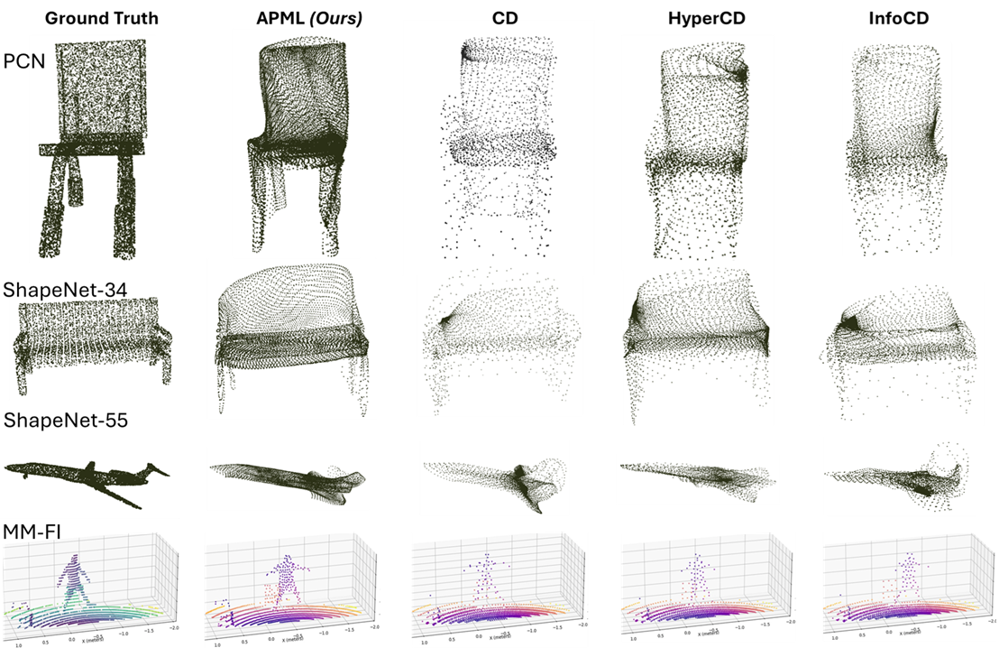

# APML: Adaptive Probabilistic Matching Loss for Robust 3D Point Cloud Reconstruction
[](https://opensource.org/licenses/MIT)
[](https://www.python.org/downloads/release/python-380/)

This repository contains the implementation of the **Adaptive Probabilistic Matching Loss (APML)** proposed in our NeurIPS submission. APML is designed to improve 3D point cloud reconstruction tasks such as shape completion and generation by providing a differentiable and efficient alternative to existing loss functions.





[**[Paper]**](https://github.com/apm-loss) - Coming! Not share for anonymization purposes during review process.

[**[Pretrained Models]**](https://drive.google.com/file/d/1dSuBUrZQzAWsxYH6j_EP-EAhgsRfvP5t/view?usp=sharing) - Available checkpoints files for testing.

## About

Training deep learning models for point cloud prediction tasks depends critically on the choice of loss function to measure discrepancies between predicted and ground-truth point sets. Commonly used losses such as Chamfer Distance (CD), HyperCD, and InfoCD rely on nearest-neighbor assignments, which often result in many-to-one correspondences, leading to point congestion in dense regions and insufficient coverage in sparse areas. Additionally, these losses include non-differentiable operations that can hinder gradient-based optimization.

While Earth Mover Distance (EMD) enforces one-to-one assignments and better captures structural similarity, its cubic computational cost makes it impractical for large-scale models.

APML addresses these limitations by introducing a fully differentiable approximation of one-to-one matching. It leverages Sinkhorn iterations over a temperature-scaled similarity matrix derived from pairwise distances, and analytically computes the temperature to ensure a minimal assignment probability. This removes the need for manual tuning and results in a near-quadratic runtime.

## Key Features

- Fully differentiable loss function
- Analytical temperature computation for stable assignments
- Compatible with architectures such as PoinTr, PCN, FoldingNet, and CSI2PC
- Improves spatial distribution of predicted points, particularly in sparse regions
- Achieves faster convergence and competitive or superior quantitative results

## Integration

This repository provides only the implementation of the loss function. To use APML in your models, you should integrate it into an existing 3D point cloud architecture. We recommend starting with one of the following repositories:

- [PoinTr](https://github.com/yuxumin/PoinTr)
- [CSI2PointCloud](https://github.com/arritmic/csi2pointcloud)

In each case, replace the existing loss function with `apml_loss.py` provided here and ensure the input/output shapes match the expected format.

## Repository Structure

```text
apml/
├── src/
│   └── loss/
│       └── loss/apml_loss.py   # Core implementation of the Adaptive Probabilistic Matching Loss (APML)
├── models/                     # Links, metadata, or scripts to download and manage pretrained models
├── scripts/                    # Example scripts for integrating and testing the loss function
├── docs/
│   └── images/                 # Visualizations and figures used in the documentation or README
└── README.md                   # Main project documentation with usage instructions

```

## License
This project is licensed under the MIT License